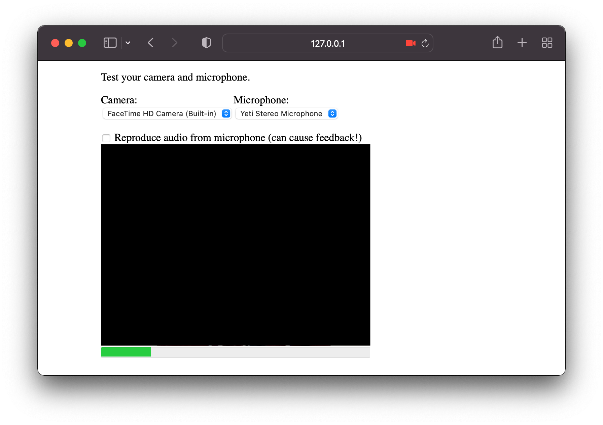

# Video SDK: Test Camera and Microphone

This repository contains the implementation of a basic web page for testing your camera and microphone before joining a video-conference.

The web page is extremely simple, with the only external dependency being the [SignalWire SDK](https://www.npmjs.com/package/@signalwire/js).

You can customize the code to include it in your application.

  

### Running the code

To test the code, you must run the application with the command `npm start`. This will start a simple web server (an HTTP connection is required for security reasons in order to access microphones and cameras). A web page will open automatically in the browser.
